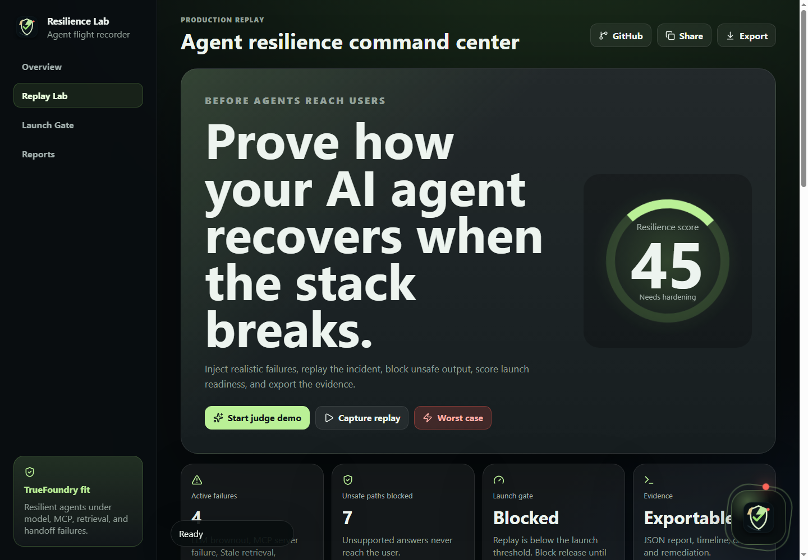

# Resilience Lab

**Replay the moment your AI agent breaks.**

Resilience Lab is an agent flight recorder and chaos replay console for teams shipping AI agents into production. It injects realistic failures across the agent stack, replays the incident, scores launch readiness, blocks unsafe paths, and exports proof that the agent recovered safely.

Live demo: https://resilience-lab-nine.vercel.app  
Judge mode: https://resilience-lab-nine.vercel.app?demo=judge



## Why It Exists

Most AI demos prove the happy path. Production agents fail in the messy middle: a model provider browns out, an MCP server returns 500s, retrieval sends stale context, a schema contract breaks, or a handoff system refuses writes.

Resilience Lab makes those failure modes visible, repeatable, and testable before users are exposed to them.

## What It Does

- Runs a one-click judge demo with a preloaded high-risk incident.
- Simulates model, MCP, retrieval, schema, and handoff failures.
- Generates a timestamped agent replay with recovery behavior.
- Scores resilience and launch readiness.
- Shows dependency health across the agent stack.
- Blocks unsafe user-facing answers when the recovery path is not trustworthy.
- Produces remediation work with owners and priorities.
- Saves recent replay sessions locally.
- Copies a plain-language evidence report.
- Downloads a JSON artifact for launch reviews, incident tickets, or future regression tests.

## Hackathon Fit

Primary sponsor target: **TrueFoundry: Resilient Agents**.

The challenge asks what happens when agents face MCP failures, LLM provider downtime, and infrastructure chaos. Resilience Lab answers that directly: it shows the break, proves the recovery path, and turns the incident into a launch gate.

## Demo Flow

1. Open judge mode: https://resilience-lab-nine.vercel.app?demo=judge
2. Show the active failures and resilience score.
3. Click **Start judge demo** to generate the claims-agent replay.
4. Scroll through the five-step workflow: scenario, failures, replay, launch gate, export.
5. Click **Worst case** to show the release being blocked.
6. Click **Copy report** or **Download JSON** to show the proof artifact.
7. Switch scenarios to show this is reusable reliability infrastructure, not a one-off assistant.

## Local Development

```powershell
npm install
npm run dev
```

## Verification

```powershell
npm run lint
npm run build
```

## Tech Stack

- Vite
- React
- TypeScript
- Lucide React
- Deterministic replay engine in `src/engine.ts`
- Local session persistence with `localStorage`

## Roadmap

- Proxy live model and MCP calls.
- Capture real request and response traces.
- Convert replay sessions into CI regression tests.
- Add hosted reports for engineering and compliance reviews.
- Add team workspaces, incident history, and launch approvals.
